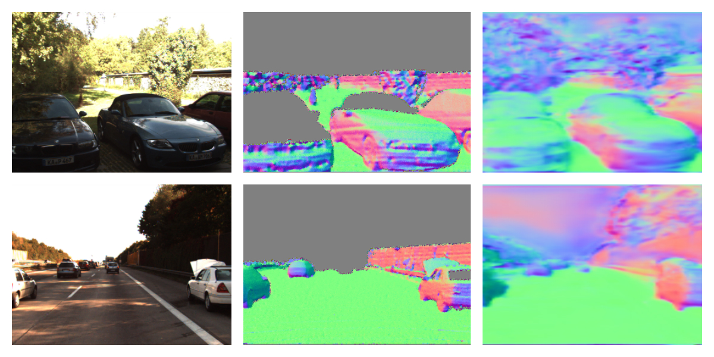

# Monocular surface normal recovery project
--------
## Introduction

This is a project to recovery surface normal from a monocular image. The main Idea of this project comes from this paper[*Marr Revisited: 2D-3D Alignment via Surface Normal Prediction*](http://www.cs.cmu.edu/~aayushb/marrRevisited) . You can view this project as an implimentation of that paper with some modifications, meanwhile I also extend the idea to outdoor scenes with success. 

Please Note that this project is done before the author release their code, so there are tiny differences with the net structure and a total different implementation of code in caffe.  I also provide the GPU implementation code of self-defined layer in caffe, so it brings a much faster training and deploying.

If you want to use the code or model to do your work or research, feel free to do it, it's opening, but please site the original author.

## Result

Blow is the result of both indoor and outdoor.     
The left is the rgb image, mid is the ground truth of surface normal and right is the model's prediction.   
**Indoor**   
  

The Indoor result uses nyu indoor data. About 4k images was picked out to do the training job. Note that only use the standard 768 images can also give a competitive result.

**Outdoor**   

The outdoor result is finetuned from the indoor model, it uses the kitti stereo dataset, the stereo dataset contains only about 400 images, since the outdoor and indoor scene structure is completely different, so the result is not that good. But note that the kitti odometry dataset has much more data, so it can be used to do the training job too.

##Net Structure

The net structure prototxt file can be seen in the model dir. It is also shown as blow.


This project uses the VGG pre-trained work by firstly convert it to a full convolution one. Note that recently the amazing work [Deep residual learning for image recognition](https://github.com/KaimingHe/deep-residual-networks) shows that deeper net can brings a much better result, so using the same feature based on this net structure may bring further improvement. And this job is left to do.

##How to

### Just to run the prediction

To run the code or model in this project, you have to install the **caffe** under my repository, It contains some self self-implementation code of caffe layer to help complete the project. (though there are some extra code in it you may not need, just leave it alone. They are for other jobs). clone the caffe by
```
git clone https://github.com/JiangQH/caffe.git
```
And build caffe follow the [instructions in their homepage](http://caffe.berkeleyvision.org/install_apt.html)

For those who just want to use the model. Can download them from the google drive blow  
[Indoor Model](https://drive.google.com/open?id=0BxGgf7b9zEpwMnFoV2F3MDRXMTA)       [Outdoor Model](https://drive.google.com/open?id=0BxGgf7b9zEpwZDZmb3lWLUxkR0k)  

Then the deploy file in the model dir can be used to do the prediction job.

 Use the predict.py file in the source folder to do the prediction job. Please make sure that the python dir in caffe is under the $PYTHONPATH.

### Train from scratch

**Data preparation**
For those who want to train from scratch, you should prepare your own rgb and normal data.(you can use the code under my another repository to do the job, which will be released soon). The rgb image and normal file should have exactly the same name except the extension. And the normal file should be stored as binary file. When the data preparation is done, say saved in **rgb_folder** and **normal_folder**.

Then use the source_generator.py file in the src folder to do the final data preparation job. Detail is described in that file.

**Model preparation**
Since we train the model based on the pre-trained VGG net. You should firstly get their model and deploy file, then use the fc_convert.py file in src folder to convert the model to a full convolution one.

**Train**
After every thing is done, using train.sh in the folder to do the training job. You should remember to change some paths in that file to make everything work right. And the solver file should be changed in order to best fit your data.
Note the training log is saved, so you can further plot the training process to monitor the network and adjust hyperparams.

## Note
If you have any problem, you can contact me [mylivejiang@gmail.com](mylivejiang@gmail.com)


